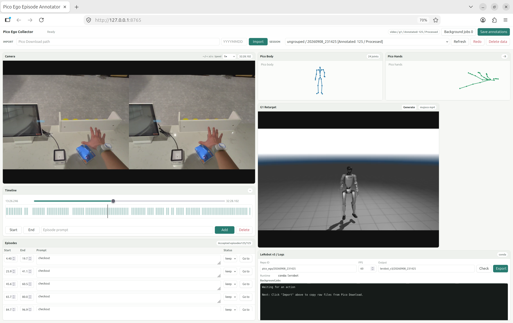

# Pico Ego Collector

English · [中文](README_zh.md)

Convert Pico egocentric video and full-body tracking into **LeRobot v3** datasets using
web-based episode annotation and G1 retargeting. Includes skeleton and robot previews,
plus a standalone Wuji hand retargeting tool.



```text
Pico tracking + video → Import → Preview → Annotate episodes and tasks → Export LeRobot v3
```

## Installation

Requires **Ubuntu and Conda**. From the cloned repository, run:

```bash
./install.sh
```

The script installs system dependencies, submodules, and the Python 3.10 `pico` / `lerobot`
environments. CUDA is not required. You can rerun it after an interruption; use
`--skip-system` if an administrator has already installed the system packages.

## Usage

```bash
./start_data_web.sh
```

Open <http://127.0.0.1:8765>:

1. Connect the Pico, allow USB file transfer, and import recordings by date. You can also populate `raw/<session>/` manually.
2. Select a session and click **Generate** to retarget the body to G1 and create a preview.
3. Mark **Start** and **End**, enter a prompt, click **Add** for each episode, then **Save annotations**.
4. Click **Check**, then **Export**. Progress appears on the page; datasets are saved under `lerobot_v3/`.

Missing hand data triggers a confirmation. Accepted exports use zero placeholders or
short-gap filling, with validity masks retained.
**Web imports delete paired source files from the Pico after successful copying.** To keep
originals on the device, import with
`conda run -n pico python scripts/sync_pico_download.py --keep-source`.

For remote access, use `ssh -L 8765:127.0.0.1:8765 user@server`.
On a headless machine without working EGL, use
`MUJOCO_GL=osmesa PICO_OPEN_BROWSER=0 ./start_data_web.sh`.

## Output and layout

```text
raw/<session>/         # trackingData_*.txt + CameraRecord_*.mp4
lerobot_v3/<dataset>/
  data/                # Sharded Parquet
  videos/              # RGB video; stereo split and H.264 by default
  meta/                # Episodes, tasks, statistics, camera and coordinate metadata
scripts/               # Import, retargeting, preview, export, and web server
configs/               # Wuji configurations
third-party/           # GMR / wuji-retargeting submodules
```

Exports default to **60 Hz** and contain RGB, Pico head/body/hand poses, G1 36D qpos, and
validity masks. These are observation datasets: **`action` and `observation.state` are not
automatically generated**. The standalone Wuji tool writes separate finger trajectories;
the base exporter stores Pico 26-point hand poses, without Wuji qpos fields.
See the [data format](docs/lerobot_v3_release_spec.md) for fields, coordinates, and loading examples.

Annotations and intermediate results stay in `/tmp/pico_ego_collector/` after export.
For persistent storage, launch with `PICO_EGO_TMP="$PWD/.work" ./start_data_web.sh` and back up
the session `annotations/` directories. Git ignores data, caches, and local experiments;
add new core files to the `.gitignore` allowlist.
See the [pipeline reference](docs/pipeline_reference.md) for CLI commands and device grouping.

## License

Project code is licensed under [MIT](LICENSE). GMR, Wuji, and their model assets retain their own licenses.
